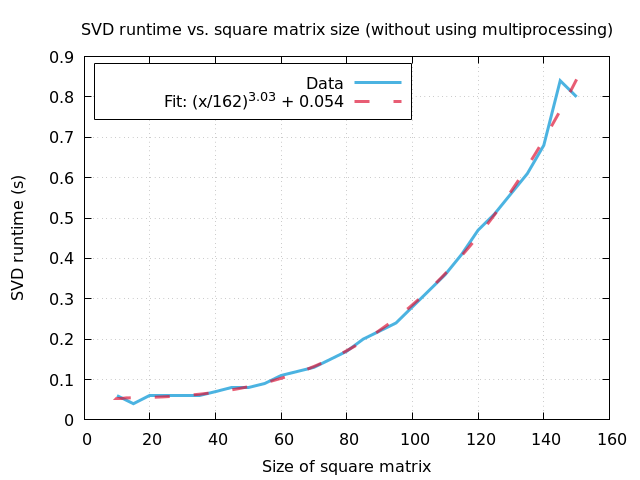

## Exam spring 2024 - Praktisk Programmering og numeriske metoder.

### Table of Contents
 - [Subject](#subject)
 - [Problem](#problem)
 - [Algorithm](#algorithm)
 - [Time complexity](#time-complexity)
 - [Use cases](#use-cases)
 - [Testing implementation](#testing-implementation)
 - [Testing time complexity](#testing-time-complexity)
 - [Optimization](#optimization)

### Subject
The singular value decomposition of a real m x n matrix A, is a decomposition of the form:

 A = USVT 

where U is a semi-orthogonal m x n matrix, i.e UTU = I, S is a diagonal n x n matrix and V is an orthogonal n x n matrix, i.e VTV = VVT = I. Assume in all following sections that all matrices are real.

### Problem
Implement the one-sided Jacobi SVD algorithm.

### Algorithm
I will implement the one-sided Jacobi SVD algorithm. It is an iterative algorithm transforming A into a matrix with orthogonal columns, with each iteration being a Jacobi rotation:

 A → AJ(θ,p,q) 

with the Jacobi rotation matrix J(θ,p,q) being the same one used in the Jacobi eigenvalue algorithm, which we implemented in a homework, given by eq. 4.8 in the notes. At each iteration θ is chosen s.t. the p'th (a'p) and q'th (a'q) columns in the resulting matrix A' = AJ(θ,p,q) now are orthogonal. It is easy to see that:

 a'p = cos(θ)ap - sin(θ)aq &nbsp&nbsp&nbsp and &nbsp&nbsp&nbsp a'q = sin(θ)ap + cos(θ)aq. 

Requiring a'pTa'q = 0 yields

 0 = cos(θ)sin(θ)apTap - sin2(θ)aqTap + cos2(θ)apTaq - cos(θ)sin(θ)aqTaq 

which can quickly be rewritten into

 (tan2(θ) - 1) apTaq = tan(θ) (apTap - aqTaq). 

Using some trigonometric formulas, we arrive at the following condition θ should satisfy to ensure that a'pTa'q = 0:

 tan(2θ) = 2apTaq / (aqTaq - apTap). 

The indices (p, q) are now swept through cyclically, where p = 1, 2, ... , n and q = p + 1, ... , n. These sweeps are performed until convergence is reached. The criteria used for convergence is, that a'pTa'q ≈ 0 within some relative error ε and absolute error δ, for all p and q in that sweep. I choose ε = δ = 10-14. It is worth noting here, that we can only hope to make all columns of the resulting matrix A' orthogonal, if the original matrix A is tall, i.e m >= n. Otherwise we would get n linearly independent vectors in a m-dimensional vectorspace where n > m, which cant be. Now once convergence is reached we have,

 A' = AJ 

where J is the product of all Jacobi rotations made through all the sweeps. Now let

 V = J, &nbsp&nbsp&nbsp Sii = || a'i || &nbsp&nbsp&nbsp and &nbsp&nbsp&nbsp ui = a'i / || a'i || 

where ui is the i'th column of U. Using these it follows immediately that A = USVT.

### Time complexity
For simplicity assume that A is a matrix of size n x n. Then each Jacobi rotation takes O(n) operations. In each sweep over indices (p, q) we do O(n2) Jacobi rotations, implying that each sweep takes O(n3) operations. The full algorithmic complexity of course depends on the number of sweeps performed, which will largely depend on the matrix at hand.

### Use cases
First an overview.

 1. Computation of **pseudo-inverse** A- of matrix A.
 2. Computing **least squares** solution to an overdetermined system of linear equations Ax = b, where A is a m x n matrix, according to eq. 3.13 from the notes, x = A-b.
 3. Computing the **rank** of an m x n matrix A as the number of non-zero singular values.
 4. Compute **lower rank approximation** A' = U'S'V'T with rank r < Rank(A) of some m x n matrix A. This matrix minimizes the Frobenius norm between A and all rank r matrices. It can be computed as follows; Let S' be the r x r diagonal matrix only containing the largest r singular values of A, let U' be the m x k matrix containing the corresponding r left singular vectors and let V' be the m x k matrix containing the corresponding r right singular vectors.

Then a more in depth analysis of each application. 

The <strong>pseudo-inverse</strong> of a m x n matrix A, is a n x m matrix A- satisfying the following equation:

 AA-A = A. 

Let A = USVT and choose A- = VS-UT then it is easy to check that the above condition is satisfied:
 

 AA-A = (USVT) (VS-UT) (USVT) = U (SS-S) VT = USVT = A. 

For a diagonal matrix as S, the pseudo-inverse is particularly easy to compute, just invert all non-zero diagonal elements.

Now consider an overdetermined system of linear equations, 

 Ax = b. 

If the linear equations are linearly independent, then we can only hope to get an approximate solution minimizing || Ac - b ||. To solve this <strong>least squares</strong> problem we will use singular value decomposition. For such a system A is tall, so we can apply the one-sided Jacobi algorithm to obtain,

 A = USVT. 

We want to minimize || Ac - b ||, which can be done by rewriting it using the projection operators UUT and 1 - UUT, onto the column space of A and its orthogonal complement. Using this:

 || Ac - b ||2 = || UUT (Ac - b) ||2 + || (1 - UUT) (Ac - b) ||2 = || U (SVTc - UTb) ||2 + || (1 - UUT) b ||2 = || SVTc - UTb ||2 + || (1 - UUT) b ||2, 

where the last equality follows from semi-orthogonality of U. The last term is independent of c, so when minimizing with respect to c, we only have to consider the first term. This is clearly minimized if,

 c = VS-UTb = A-b. 

So we have an easy way of computing least squares solutions using the pseudo-inverse.

To estimate the <strong>rank</strong> of a m x n matrix, I will once again use singular value decomposition,

 A = USVT. 

We can only get this using the one-sided Jacobi algorithm if A is tall, i.e m > n, but even if m < n we can just use the algorithm on AT and utilize that the dimension of the row-space and column-space of a matrix are equal to obtain rank(A). Assume we have decomposed A as above and lets rewrite that expression a bit:

 A = USVT = U(VS)T = U([S11v1 ... Snnvn])T = ∑i=1..n SiiuiviT. 

The last step can easily be checked by writing out both sides explicitly. From this it is quite clear that if vj corresponds to a singular value Sjj = 0, then vj is contained in the null space of A:

 Avj = ∑i=1..n Siiui(viTvj) = Sjjuj = 0. 

Using this it is not too hard to show, that the null space of A is spanned by the right singular vectors vj corresponding to vanishing singular values Sjj = 0. Call the dimension of this null space null(A). By the rank-nullity theorem:

 n = rank(A) + null(A) &nbsp&nbsp&nbsp &rarr; &nbsp&nbsp&nbsp rank(A) = n - null(A) 

so the rank(A) is precisely the number of non-vanishing singular values.

We will now discuss how to obtain a <strong>lower rank approximation</strong> to a tall m x n matrix A. We can as above use the one-sided Jacobi algorithm to obtain a singular value decomposition of A:

 A = USVT = ... = ∑i=1..n SiiuiviT. 

From this it is clear that the most significant contributions in the sum corresponds to the largest singular values Sii. Assume for simplicity that the singular values are ordered in descending order. Then keeping only the r < rank(A) largest:

 A' = ∑i=1..r SiiuiviT = ... = U'S'V'T, 

where S' is the r x r diagonal matrix only containing the largest r singular values of A, U' is the m x k matrix containing the corresponding r left singular vectors and V' is the m x k matrix containing the corresponding r right singular vectors. Using the same argument as for the rank(A), it is clear that rank(A') = r. It can be shown that A' minimizes the Frobenius norm between A and all rank-r matrices of same size, so it is the best rank-r approximation to A with respect to that norm.
    
### Testing implementation
I made several tests checking functionality of the singular value decomposition itself, as well as the above mentioned use cases of it, which is implemented in the same class. 

The <strong>first test</strong>, checked functionality of the singular value decomposition on k = 100 square matrices each of size n x n chosen randomly each s.t. n = 1, ... , 50. Given a SVD 

 A = USVT 

it is checked that U and V are both orthogonal (in special case of square matrices, U is an orthogonal matrix) and that the above equality holds. Matrix equalities are computed up to an absolute- and relative-error of the entries of 10-9. It resulted in 100 passed cases and 0 failed cases.

The <strong>second test</strong>, checked functionality of the singular value decomposition on k = 100 tall matrices each of size m x n chosen randomly each s.t. m > n and m, n = 1, ... , 50. Given a SVD 

 A = USVT 

it is checked that U are semi-orthogonal, V are orthogonal and that the above equality holds. Matrix equalities are computed up to an absolute- and relative-error of the entries of 10-9. It resulted in 100 passed cases and 0 failed cases.

The <strong>third test</strong>, checked functionality pseudo-inverse solver in SVD class on k = 100 tall matrices A each of size m x n chosen randomly each s.t. m > n and m, n = 1, ... , 50. In each case it is checked that

 AA-A = A. 

Matrix equalities are computed up to an absolute- and relative-error of the entries of 10-9. It resulted in 100 passed cases and 0 failed cases.

The <strong>fourth test</strong>, checked functionality least squares solver in SVD class on k = 100 tall matrices A each of size m x n chosen randomly each s.t. m > n and m, n = 1, ... , 50. In each case it is checked that the predicted least squares solution

 x = A-b 

to the overdetermined system of linear equations Ax = b, agreed with the one computed using QR-decomposition. This was implemented in a homework. Vector equalities are computed up to an absolute- and relative-error of the entries of 10-9. It resulted in 100 passed cases and 0 failed cases.

The <strong>fifth test</strong>, checked functionality method in SVD class providing rank-r approximation on k = 100 tall matrices A each of size m x n chosen randomly each s.t. m > n and m, n = 1, ... , 50. . Testing that the rank-r approximation minimizes the Frobenius norm of
the difference between the matrix and all rank-r matrices is not easy. So I made a more basic test, checking in the limiting case of r = Rank(A) that the approximation is equal to A itself. Matrix equalities are computed up to an absolute- and relative-error of the entries of 10-9. It resulted in 100 passed cases and 0 failed cases.

### Testing time complexity
I computed the singular value decomposition of random n x n square matrices in the range of n in [10, 150]. This yielded the following result,

  

which is in clear agreement with our O(n3) expectation for the operation count.

### Optimization
The tall matrices we use in the one-sided Jacobi algorithm, does not have a lot of symmetry (compared to the real symmetric matrices in the Jacobi eigenvalue algorithm), so we will not get any optimization from such considerations. If we were only interested in the singular values, then obvious optimizations could be obtained by not spending both time and memory computing the V and U matrices, but we use them explicitly in applications such as computing pseudo-inverses, solving least squares problems and computing lower rank approximations. 
One slight optimization that I implemented, is to represent the diagonal matrix S in the singular value decomposition as a vector instead of a matrix, thus taking up less memory. By following this line of thought, computing matrix products such as US can be computed efficiently utilizing that S is diagonal, i.e just multiply i'th column of U by i'th diagonal element of S. The operation count for regular naive matrix multiplication goes as O(n3) for square matrices, where utilizing the structure of S in products, such as above, improves it to go as O(n2), again for square matrices.

As for optimizations of the tests, one should utilize that each test is independent, so they could each be run on a separate processor each, if there are at least 5 processors available, which there is on my computer. This is implemented in the Makefile of the project.